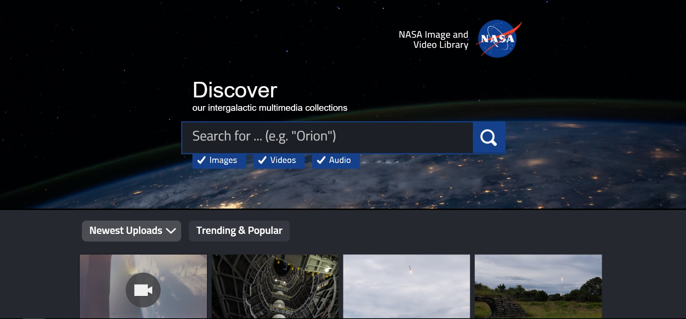
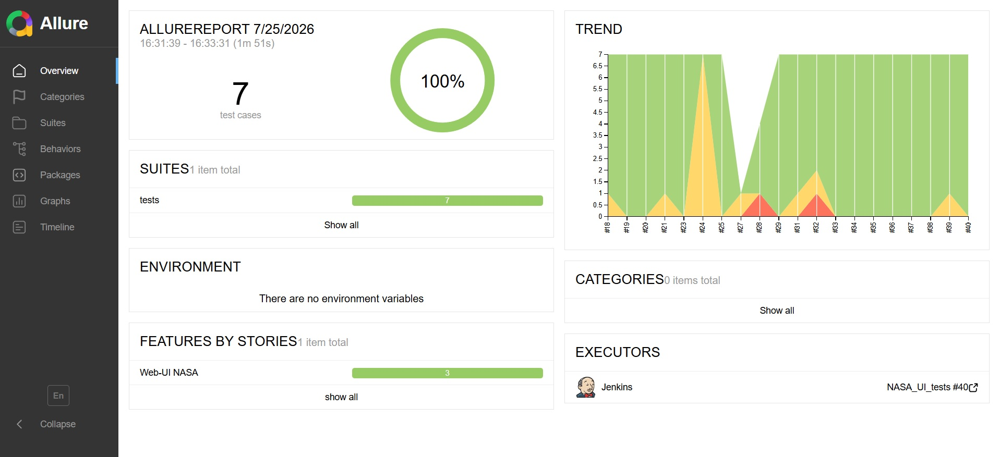
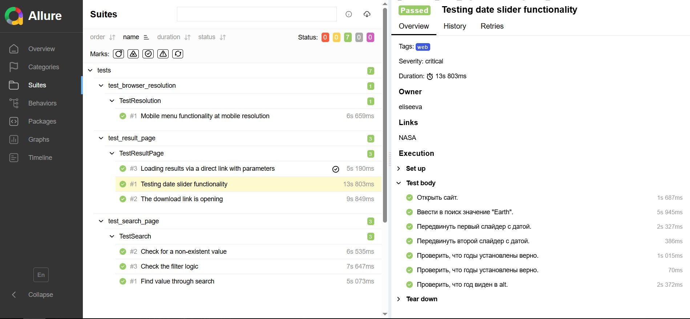
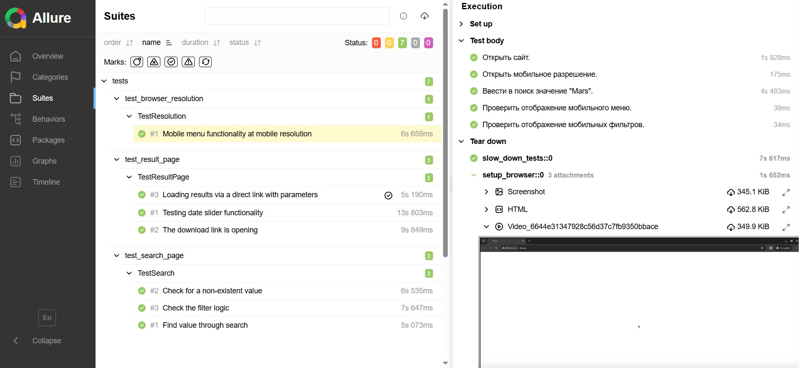
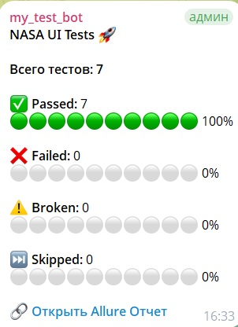
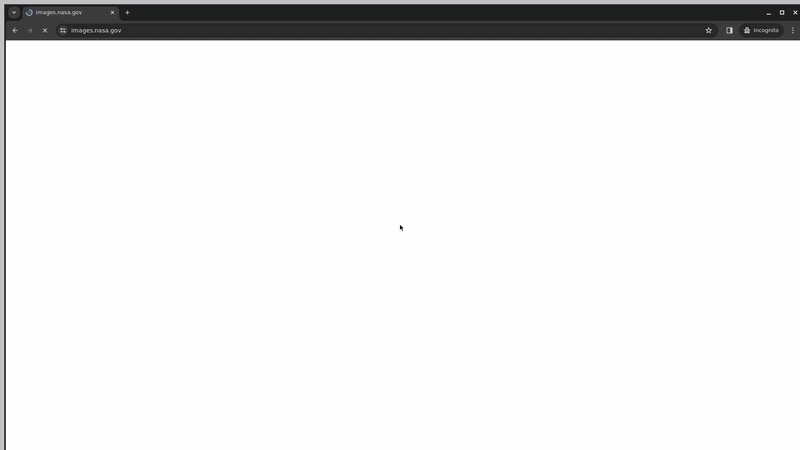

# Проект по UI автоматизации тестирования сайта [NASA](https://images.nasa.gov)

----
### Проект реализован с использованием:
 
 
  
 
 
 


----
### Особенности проекта
* Оповещения о тестовых прогонах в Telegram
* Отчеты с видео, скриншотом, логами, исходной моделью разметки страницы
* Сборка проекта в Jenkins
* Отчеты Allure Report
* Запуск web/UI автотестов в Selenoid
* Обход WAF и Anti-Bot защит (NASA): Добавлены Jitter-задержки (рандомизированный Smart Polling), снятие Selenium-маркеров и подмена заголовков для обхода Rate Limiting (HTTP 429) на серверах.
* 📡 Bypass сетевых блокировок (Telegram): Из-за блокировок API Telegram на стороне провайдера сервера, разработан собственный reverse-proxy на базе Cloudflare Workers. Реализован принудительный DNS-резолвинг (--resolve) в bash-скриптах Jenkins для гарантированной доставки отчетов.
* Асинхронный рендер видео в Selenoid. Написан механизм умного ожидания (Smart Polling) для скачивания mp4 артефактов из Docker-контейнеров Selenoid, исключающий Flaky-падения тестов.
----
 ### Список проверок, реализованных в web/UI автотестах
- [x] Проверка поиска.
- [x] Проверки логики фильтрации и пагинации.
- [x] Проверка отображения сайта в мобильном разрешении.
- [x] Валидация Deep Linking (открытие страниц по прямым ссылкам с параметрами).
- [x] Проверки медиаплеера и скачивания медиафайлов.

## 🛠 Инженерные решения и обход ограничений (Troubleshooting)

Тестирование реального высоконагруженного ресурса (NASA Images API) требует обхода встроенных защит WAF и оптимизации работы браузера в CI/CD. В `conftest.py` реализованы следующие паттерны:

>* **Rate Limiting & Bot Protection Bypass:**  Публичные API NASA агрессивно блокируют быстрые автоматизированные запросы (HTTP 429 Too Many Requests). 
>  * Использована фикстура `slow_down_tests` с рандомизированной задержкой, имитирующая поведение реального пользователя.
>  * Применены флаги сокрытия автоматизации (`excludeSwitches`, `useAutomationExtension`) и подмена User-Agent для прохождения базовых проверок анти-фрода.
>* **Docker & CI/CD Stability:** 
>  Для стабильного запуска Chrome внутри контейнеров Selenoid без утечек памяти и падений процесса рендеринга (`TimeoutException`) применены флаги оптимизации Linux-окружения (`--disable-dev-shm-usage`, `--disable-features=VizDisplayCompositor`, `--no-sandbox`).
>* **Асинхронный сбор артефактов (Smart Polling):**
  Видео сессии в Selenoid рендерится асинхронно после закрытия драйвера. Вместо использования нестабильных `time.sleep()`, реализован механизм умного ожидания (Polling) в `utils/attach.py`, который опрашивает сервер и скачивает `mp4` файл ровно в тот момент, когда он готов.
>* **Eager Page Load:**
  Стратегия `eager` используется для ускорения прохождения тестов: драйвер не дожидается загрузки тяжелых сторонних трекеров и аналитики, начиная проверки сразу после построения DOM-дерева.
___
### Локальный запуск

> Для локального запуска с дефолтными значениями необходимо выполнить команду:

```
python -m venv .venv
source .venv/bin/activate
pip install -r requirements.txt
```

> Перед запуском в корне проекта нужно создать файл `.env` с адресом сервера Selenoid
> (в git не коммитится):

```
SELENOID_IP=...
```

**Запуск тестов**

```
pytest tests
```

Запуск отдельного файла:

```
pytest tests/test_search_page.py
```

> Браузеры запускаются не локально, а на удалённом сервере через Selenoid (порт `4444`).
> Используется Chrome 123.0. Для записи видео на сервере должен быть настроен video-recorder.

**Allure-отчёт локально**

```
pytest tests
allure serve allure-results
```

> Для `allure serve` нужен установленный Allure CLI (отдельно от pip).

----

### Удалённый запуск автотестов выполняется на сервере Jenkins

> CI развёрнут на собственном сервере. Доступ к Jenkins — по логину и паролю:
> ссылка и гостевой доступ предоставляются по запросу.

#### Для запуска автотестов в Jenkins

1. Открыть проект в Jenkins (доступ по логину и паролю)
2. Нажать кнопку `Build with parameters`
3. Выбрать тесты для запуска
4. Результат запуска сборки можно посмотреть в отчёте Allure в интерфейсе сборки

#### Параметры сборки

> `tests` – запускает все тесты проекта.
>
> `tests/test_search_page.py` – тесты поиска.
>
> `tests/test_result_page.py` – тесты страницы результатов.
>
> `tests/test_browser_resolution.py` – тесты мобильного разрешения.

> Переменная `SELENOID_IP` должна быть задана в настройках сборки Jenkins.

### Allure отчет

#### Общие результаты


#### Список тест кейсов в Allure 


#### Пример тест кейса в Allure с логированием и attachments


#### Нотификация в Telegram


#### Видео прохождения теста UI
